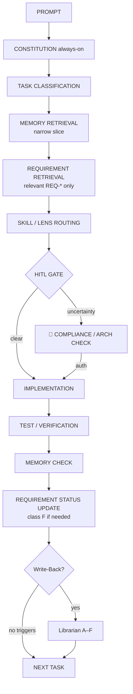

# Agent Workflow & Context Routing (SmartSenior / Pakiet Spokoju)

> **Dla laika / Ops / VC (język prosty):** [`AGENT_WORKFLOW_README.md`](AGENT_WORKFLOW_README.md)

Model: **Single Developer + Skill Lenses + Second Brain 2.0**.  
Jeden agent-developer — bez multi-agent. Pamięć projektu: *remember broadly, retrieve narrowly*.

**Wersja mapy:** 2026-08-21 · ADR-003/004/006/008/010/011/012 · HLD 2.4.9 · Requirements Traceability

---

## 1. Decision graph



### Przepływ tekstowy

```text
PROMPT
  → CONSTITUTION
  → TASK CLASSIFICATION
  → MEMORY RETRIEVAL
  → REQUIREMENT RETRIEVAL (docs/REQUIREMENTS_TRACEABILITY.md — wąski slice)
  → SKILL / LENS ROUTING
  → HITL GATE
  → IMPLEMENTATION
  → TEST / VERIFICATION
  → MEMORY CHECK
  → REQUIREMENT STATUS UPDATE (gdy REQ dotknięty)
  → WRITE-BACK | skip
  → NEXT TASK
```

**Zasady REQ:** *Implementation is not verification.* Nigdy `VERIFIED` bez evidence. Krytyczne REQ ≠ VERIFIED → mów wprost o braku weryfikacji (nie „security satisfied”).

---

## 2. Memory Lifecycle

Wpisy pamięci (głównie ADR; opcjonalnie LESSONS) mają status:

| Status | Użycie |
|--------|--------|
| `ACTIVE` | Obowiązuje |
| `PROPOSED` | Szkic — nie implementuj jako pewnik |
| `SUPERSEDED` | Historia — idź do `superseded_by` |
| `DEPRECATED` | Niezalecane |
| `ARCHIVED` | Tylko archiwum |

Frontmatter ADR (szablon `docs/adr/000-template.md`): `status`, `created`, `updated`, `source`, `supersedes`, `superseded_by`, `confidence` (`HIGH`/`MEDIUM`/`LOW`).

**Rodzaje wiedzy (nie mylić):**

| Rodzaj | Gdzie | Autorytet |
|--------|-------|-----------|
| Decyzja architektoniczna | ACTIVE ADR + HLD | Decyzja |
| Stan implementacji (live) | MASTER_CONTEXT | Stan „co jest teraz” |
| Polityka security | SECURITY.md | Non-negotiables |
| Lekcja operacyjna | LESSONS_LEARNED (ACTIVE) | Quirk — nie nadpisuje ADR/HLD |
| Wymaganie HLD + ślad weryfikacji | `REQUIREMENTS_TRACEABILITY.md` (`REQ-*`) | Status ≠ VERIFIED ⇒ nie mów „spełnione” |
| Historia | SUPERSEDED / ARCHIVED / §10 stare wiersze | Nie steruje kodem |

---

## 3. Selective retrieval (*retrieve narrowly*)

Po klasyfikacji taska **nie** ładuj całego Second Brain. Preferuj:

### UI / copy / spacing

- `product-ui-craft.mdc`, `frontend-next.mdc` (glob `web/**`)
- Legacy tylko gdy scope to `index.html` / `src/js/*`: `frontend-js.mdc`  
- **Nie:** IoT, compliance refs, pełny HLD, wszystkie ADR

### Database / RLS / migracje

- `MASTER_CONTEXT` §5–6 (+ §7a jeśli telemetria)
- `REQ-SEC-*`, `REQ-DATA-*` (wąski slice z `REQUIREMENTS_TRACEABILITY.md`)
- `supabase-seniorsmart` (+ `schema-seniorsmart.md` gdy schema)
- `secure-by-design` / HITL jeśli RLS/RBAC
- ACTIVE ADR dotyczące tabeli (np. ADR-012 przy telemetrii; ADR-006 przy RLS)
- LESSONS tylko przy dziwnym błędzie DB  
- **Nie:** product-ui craft całość, Cloudflare checklist bez deployu

### AI / Guardrails / Peace Letter

- `ai-prompt-guardrails.mdc` (System Prompt §7, conversational JSON), `guardrails-tester.mdc` przy zmianie AI
- `REQ-AI-*`, `REQ-FUNC-001`, `REQ-FUNC-002`
- HLD §B.2; MASTER §7; **ADR-010**
- ACTIVE ADR AI/IoT non-MD gdy dotyczy
- `compliance-medtech` → `eu-ai-act.md` gdy risk/oversight  
- **Nie:** pełne ISO/NIS2 refs bez triggera compliance

### IoT / telemetria

- **ADR-012** (poza MVP) + `REQ-IOT-004`
- MASTER §7a; `consent_ledger` jako hak Fazy 3
- **Nie** implementuj Polar / `iot_gateways` / `telemetry_logs`
- Skill `telemetry-context-provider` = DEFERRED
- **Nie:** UI craft, chyba że empty-state komfortu w portalu rodziny

### Offline / NFR / sync

- `REQ-NFR-*` / `REQ-FUNC-*` właściwe
- HLD A.3 / E skrót; MASTER gdy stan live

### Deploy Cloudflare

- `cloudflare-seniorsmart` + deploy-checklist
- MASTER §8  
- **Nie:** AI guardrails matrix

### Debug > 15 min / dziwny błąd

- Najpierw **ACTIVE** wpisy w `LESSONS_LEARNED`
- Potem wąski slice MASTER / ADR wg obszaru

### Write-Back / synteza docs

- Pełny tryb Librarian (`second-brain-librarian.mdc`)

---

## 4. Write-Back triggers (Memory Check)

Źródło prawdy checklisty: `second-brain-librarian.mdc`.

```text
MEMORY CHECK — Did this task change:
architecture | database/schema | API/contract | authentication |
authorization/RLS/RBAC | deployment/infrastructure |
AI/LLM contract | IoT/telemetry contract |
security/compliance assumptions | project convention |
debugging knowledge | existing architectural decision |
current implementation state |
tracked requirement (REQ-*) | verification evidence
```

- **Żadne** → *No Write-Back required*  
- **≥1** → *Write-Back required* → Librarian klasy **A–F** (F = `REQUIREMENTS_TRACEABILITY`)

---

## 4a. Requirement Verification Gate

Gdy task dotyka CRITICAL `REQ-*`:

1. Odczytaj status z rejestru.  
2. Jeśli ≠ `VERIFIED` — **nie** raportuj spełnienia; podaj status + brakujące evidence.  
3. Niepewność weryfikacji security/compliance/AI → respektuj HITL.  
4. Fail testu → ustaw `FAILED` w rejestrze (klasa F).

---

## 5. Contradiction handling

1. Nazwij konflikt.  
2. Autorytet: ACTIVE ADR + HLD (decyzja) → MASTER (stan live, uzgodniony) → SECURITY (polityka) → LESSONS (quirk).  
3. Oznacz stare SUPERSEDED/DEPRECATED; popraw MASTER.  
4. Hard gate (arch/RLS/compliance/AI Act/IoT auth) → HITL, nie ciche wybory.

---

## 6. Konstytucja i soczewki (mapa plików)

### Always-on

`living-context` · `architectural-guardian` · `secure-by-design` · `clean-scalable-code` · `product-ui-craft`  
(+ cienkie pointer skills w `.agents/skills/` — discovery, nie druga konstytucja)

### On-demand / glob

| Soczewka | Trigger |
|----------|---------|
| `compliance-medtech` + refs | dane / audyt / prawo |
| `ai-prompt-guardrails` | LLM / prompt / RAG / conversational voice / Peace Letter |
| `guardrails-tester` | AI TS + `tests/` |
| `supabase-seniorsmart` + schema ref | DB / RLS / Edge |
| `cloudflare-seniorsmart` | OpenNext Worker / legacy Pages / Wrangler |
| `frontend-js` / `frontend-next` / `backend-ts` | Legacy FE JS / Next `web/` / Edge TS |
| `telemetry-context-provider` | DEFERRED (ADR-012) — nie ładuj na MVP |
| `second-brain-librarian` | Memory Check / Write-Back / docs |

### Docs pamięci

HLD · MASTER_CONTEXT · SECURITY · `docs/adr/*` · LESSONS_LEARNED · **`docs/REQUIREMENTS_TRACEABILITY.md`** · **ten plik**

**HITL stop:** sprzeczność z HLD; niepewność RODO/AI Act; RLS/RBAC bez pewności.

```
🛑 COMPLIANCE / ARCH CHECK REQUIRED - Czekam na decyzję człowieka
```

---

## 7. Walidacja scenariuszy (oczekiwane zachowanie)

| Scenariusz | Retrieval | Write-Back / REQ |
|------------|-----------|------------------|
| 1. Spacing przycisku | UI lenses only | **No** REQ / No Write-Back |
| 2. Kolumna / RLS `daily_logs` | MASTER + REQ-SEC/DATA + supabase | **B** (+ **F** status) |
| 3. Zmiana auth telemetrii | ADR-012, REQ-IOT-004, MASTER §7a | **B+C+E+F** (HITL — poza MVP) |
| 4. RLS 30 min sleuthing | LESSONS → fix | **D** (± F) |
| 5. MASTER vs ADR sprzeczne | Contradiction Protocol | E + HITL jeśli hard gate |
| A–E (REQ suite) | patrz `REQUIREMENTS_TRACEABILITY.md` | Implementation ≠ VERIFIED |

---

## 8. Zasady utrzymania

1. Nie duplikuj substancji w pointer skillach.  
2. Zmiana routingu / Memory → `living-context` potem **ten** plik.  
3. Tenant `organization_id`; deploy OpenNext `smart-senior-web` + legacy Pages `smart-senior` + `bmughdoqdsjfstxnnjks`. **Nie Vercel.**  
4. IoT ingest = poza MVP (ADR-012); Faza 3 = własne bramki, nie Polar. Brak `iot_gateways`.  
5. Peace Letter = `daily_reports` (HLD 2.4.3 / ADR-010); nie `daily_logs.processed_data`.  
6. Nie twórz `architektura-XYZ.md` ani vector DB „bo Second Brain”.
