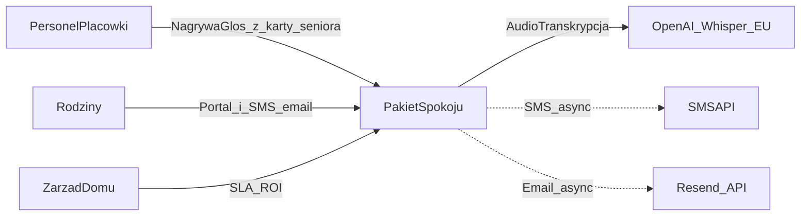

# Dokument Architektury Systemowej (HLD) — Pakiet Spokoju (SmartSenior)

| Pole | Wartość |
|------|---------|
| **Wersja** | 2.4.10 |
| **Data** | 2026-08-21 |
| **Autor** | Dariusz Olszewski-Rink (Dragonfly Ops) |
| **Przeznaczenie** | Zespół (SDD), interesariusze, due diligence (VC/grants) |
| **Strażnik** | Reguła Cursor `architectural-guardian` + skill `.agents/skills/architectural-guardian` |

> **Podział źródeł prawdy (żeby nie duplikować):**  
> - **Ten plik (`docs/HLD.md`)** — decyzje architektoniczne, NFR, przepływy, compliance posture, ekonomika, roadmapa.  
> - **[`MASTER_CONTEXT.md`](MASTER_CONTEXT.md)** — żywy stan implementacji (schema, RLS, deploy, changelog).  
> - **[`SECURITY.md`](../SECURITY.md)** — non-negotiables inżynierskie Secure by Design.  
> Detale tabel i polityk RLS **nie** są powielane tutaj — patrz MASTER_CONTEXT §5–6.

---

## A. Wstęp i założenia

### A.1 Cel i zakres

Dokument określa wysokopoziomową architekturę (HLD) platformy B2B SaaS „Pakiet Spokoju”. Jest bazą Spec Driven Development oraz fundamentem due diligence. **Nie** pokrywa LLD (detali kodu).

### A.2 Uzasadnienie stosu

| Warstwa | Wybór | Dlaczego |
|---------|--------|----------|
| Backend / DB | Supabase (PostgreSQL + Auth + RLS + Edge Functions) | Multi-tenant przez RLS; brak własnego DevOps serwerowego; region UE |
| Frontend | Next.js App Router + Tailwind + TS (`/web`, ADR-008) na **Cloudflare** (`@opennextjs/cloudflare`) | Edge UE; **zakaz Vercel**; Guardrails zostają na Supabase Edge |
| AI | OpenAI Whisper + GPT-4o (opcjonalnie Azure OpenAI EU) | Transkrypcja PL + Guardrails; Zero-Data Retention / Enterprise DPA gdy wymagane |
| Wearables | **Poza MVP** (ADR-012) | Później własne bramki w placówce — nie Polar AccessLink; non-MD |
| Komunikacja | SMSAPI + Resend (PL/EU) | Proaktywne Peace Letter bez aplikacji mobilnej rodziny |

**Stan operacyjny projektu (źródło: MASTER_CONTEXT):** Supabase `project-ref` `bmughdoqdsjfstxnnjks`, region **North EU (Stockholm)**; front kanoniczny = Next.js na Cloudflare Pages `smart-senior` (`https://smart-senior.pages.dev`, OpenNext).

> **Challenge vs wcześniejsze drafty HLD:** część materiałów mówiła „Frankfurt”. **Obowiązuje region faktycznie podlinkowany** (Stockholm). **Hosting frontu: nie Vercel.** Adapter Next.js = `@opennextjs/cloudflare` (nie `@cloudflare/next-on-pages`). Dane medyczne zostają w Supabase Stockholm — Cloudflare serwuje UI.

### A.3 Wymagania niefunkcjonalne (NFR)

| Kategoria | Wymaganie | Cel | Metryka |
|-----------|-----------|-----|---------|
| Dostępność | 99.5% uptime | System krytyczny dla komunikacji | Miesięczny uptime ≥ 99.5% |
| Wydajność | Zapis notatki &lt; 60 s; latency AI &lt; 15 s | Odciążenie personelu | p95 czasu przetwarzania |
| Odporność | Kolejka notatek przy braku sieci (przebudowa przy Next.js) | Martwe strefy Wi-Fi | 100% notatek zsynchronizowanych po odzyskaniu sieci |
| Prywatność | RODO + minimalizacja | ISO 27001 / audyt | Zero incydentów RODO w audycie zewnętrznym |
| Bezpieczeństwo | Zero-Trust + RLS + MFA (AAL2) personelu | Brak wycieku między tenantami; kradzież tabletu bez TOTP | 100% zapytań pod `organization_id` (poza `superadmin`); personel `aal2` na kartach / Peace Letter / szkicach |

---

## B. Diagramy architektury (C4)

### B.1 Context — zależności zewnętrzne



### B.2 Data flow — Conversational Voice + Guardrails (human-in-the-loop)

Asystent **nie** kończy pracy po jednej głosówce. Krótka lub niekompletna transkrypcja → pytanie do personelu. Peace Letter powstaje z **wieczornego merge** draftów i zatwierdzenia (`daily_reports.approved_by` → `published`). ADR-010.

```mermaid
sequenceDiagram
  participant App as App_Personel
  participant Edge as Edge_AI
  participant LLM as OpenAI_EU
  participant DB as Postgres_RLS
  participant Cron as Merge_CRON

  App->>Edge: JWT_plus_patient_id_plus_audio
  Note over App: Nagrywanie tylko z karty konkretnego seniora
  Note over Edge: Zero-Guessing — patient_id z payloadu, nie z LLM
  Edge->>LLM: Whisper_transcribe
  LLM-->>Edge: raw_text
  Edge->>LLM: Guardrails_JSON_anonimowy_transkrypt
  Note over LLM: LLM nie dostaje imienia ani patient_id
  LLM-->>Edge: mode_follow_up_or_draft
  alt mode_follow_up
    Edge->>DB: voice_turns_plus_draft_awaiting_staff
    Note over Edge,DB: INSERT twardo z patient_id z żądania
    Edge-->>App: Pytanie_uzupelniajace
  else clinical_or_ok
    Edge->>DB: voice_draft_notes_bound_to_request_patient_id
    Note over Edge,DB: Żargon kliniczny nigdy do rodziny; godność = generalizacja
    Edge-->>App: Zanotowano_szkic
  end
  Cron->>DB: Drafts_ready_to_merge_per_patient_day
  Cron->>LLM: Merge_plus_Guardrails
  LLM-->>Cron: Peace_Letter_candidate
  Cron->>DB: daily_reports_ready_then_HITL
  Note over Cron,App: Publikacja rodziny dopiero po approved_by + published
```

**Interactive prompting:** brak nastroju / posiłku (pora obiadowa) / snu / aktywności albo transkrypt zbyt krótki → `mode=follow_up`, **zakaz** końcowego raportu.

**Cenzura (priorytet):**
- Brak diagnoz w kanale rodziny — żargon (arytmia, furosemid, …) tylko `staff_internal_notes` / `raw_data`.
- Godność (Ustawa o pomocy społecznej): detale drastyczne → „dyskomfort” / „gorsze samopoczucie”.
- System Prompt kanoniczny: `.cursor/rules/ai-prompt-guardrails.mdc`.

**Merge:** wiele `voice_draft_notes` tego samego `(patient_id, local_date)` → Edge CRON `merge-daily-peace-letters` (Europe/Warsaw, wieczór).

**Zasada krytyczna:** żadne parsowanie / filtrowanie / Guardrails treści klinicznej w przeglądarce. Frontend = UI + kolejka offline + wywołania z JWT. Transkryptów **nie haszować** (ADR-005).

**Zero-Guessing Entity Resolution (twardy wymóg):** LLM **nie** zgaduje, którego pensjonariusza dotyczy notatka. Personel nagrywa wyłącznie z cyfrowej karty konkretnego seniora. Next.js **zawsze** wysyła `patient_id` w POST do Edge `voice-assistant`. Edge trzyma `patient_id` w RAM żądania; do OpenAI idzie tylko zanonimizowany transkrypt (bez imienia, bez UUID). Po JSON od modelu Edge robi `INSERT` do `voice_draft_notes` / `voice_*` **ponownie z tym samym `patient_id`**. Zakaz NER / „Notatka dla Jana…” jako źródło tożsamości — ryzyko RODO (błędne przypisanie) i halucynacji STT/LLM.

### B.3 Data flow — telemetria (poza MVP)

**Brak ingestu w MVP** (ADR-012). Peace Letter powstaje wyłącznie z głosu personelu (B.2). Portal rodziny pokazuje empty-state karty komfortu („w przygotowaniu”) — zero alarmów z opaski. Faza 3: własne bramki w placówce (nowy ADR; nie Polar AccessLink). `consent_ledger.wearable_family_access` zostaje jako hak na zgody IoT.

### B.4 Data flow — raport dzienny + powiadomienia (schema gotowa, Edge wysyłki jeszcze nie)

```mermaid
sequenceDiagram
  participant Cron as Merge_CRON
  participant DB as Postgres_RLS
  participant Staff as Personel
  participant Notify as Edge_notify
  participant Family as Rodzina

  Cron->>DB: daily_reports_status_ready
  Staff->>DB: HITL_approved_then_published
  Family->>DB: SELECT_family_daily_reports
  Note over Family,DB: tylko status published
  Cron->>Notify: po_kolacji_published
  Notify->>DB: INSERT_notification_deliveries_pending
  Note over Notify: service_role; recipient ze snapshotu phone/email
  Notify->>Family: SMS_lub_email
  Notify->>DB: UPDATE_delivery_sent_or_failed
```

Wysyłka SMS/e-mail **nie** dzieje się w Postgresie. Tabele `notification_preferences` / `notification_deliveries` + `profiles.phone` są na remote; job Edge jeszcze nie.

---

## C. Architektura danych

**Tabele (szczegóły w MASTER_CONTEXT):** `organizations`, `profiles`, `patients`, `daily_logs` (surowy tor personelu), `daily_reports` (Peace Letter / artefakt rodzinny), `voice_*`, `daily_agenda` / `daily_agenda_templates` (plan dnia), `family_connections`, `family_invitations` (token 7 dni, bez PII pensjonariusza w linku), `family_messages` (asynchroniczny hydrant rodziny → personel), `consent_ledger` (hak zgód IoT, bez ingestu), `notification_preferences`, `notification_deliveries`, `audit_logs`, `security_access_logs` + widok `family_daily_reports`. Tabele Polar / `telemetry_logs` **usunięte** (ADR-012). `iot_gateways` **usunięta** wcześniej (ADR-007). Brak czatu na żywo i tabeli `devices` w MVP.

**Głos (HLD 2.4.1 / ADR-010):** drafty i tury rozmowy — tylko personel (`org_admin` / `nurse`). Family: brak SELECT. Wieczorny merge + HITL zapisuje **`daily_reports`** (status `published`). `daily_logs` zostaje surowym dziennikiem personelu / sensorów — **nie** kanałem rodziny. `voice_conversations.missing_contexts` to `voice_missing_context[]` (`mood`, `meal`, `sleep`, `activity`).

**Telemetria (ADR-012):** poza MVP. Brak Polar AccessLink, brak `polar_*`, brak `telemetry_logs`. Faza 3 = własne bramki (projekt później). Non-MD: gdy ingest wróci — komfort, zero diagnozy, zero alarmów z opaski.

**Plan dnia (SC-NUR-05 / SC-FAM-06):** `daily_agenda` + szablony `daily_agenda_templates`. Personel R/W swojej org; rodzina SELECT pozycji wspólnych placówki oraz indywidualnych przy aktywnym `family_connections`.

**EU AI Act (schema):** `daily_reports.ai_model` + `approved_by` / `approved_at` przed `published`. Kolumny HITL na `daily_logs` zostają dla surowego toru personelu.

**`consent_ledger`:** wdrożony — purpose `wearable_family_access` jako hak Fazy 3 (własne bramki); wpisuje `org_admin`. Brak ingestu i DTO komfortu w MVP.

### Retencja i backup

| Warstwa | Polityka |
|---------|----------|
| Surowe głosówki (`voice_draft_notes` merged/discarded, tury i rozmowy `merged`/`abandoned`) | 30 dni od `created_at`, potem `cleanup_old_voice_drafts()` (tylko `service_role`) |
| Hot | Peace Letter / `daily_reports` ~12 miesięcy |
| Cold | Po 12 mies. pseudonimizacja / archiwum wg SLA placówki |
| Archiwum pensjonariusza | `patients.archived_at` + `archived_reason` (`deceased`, `left_facility`, `gdpr_request`) — miękka blokada; twarde Art. 17 = `DELETE patients` (CASCADE na głos i plan dnia) |
| Backup | PITR UE; **RTO = 4 h**, **RPO = 1 h** |

`audit_logs` przy DELETE na tabelach opieki/głosu zapisuje `old_data.payload = [REDACTED DUE TO GDPR]` (Art. 17). UPDATE nadal trzyma pełny snapshot (ISO). Job `cleanup-old-voice-drafts`: 03:00 Europe/Warsaw (`pg_cron`).

---

## D. Bezpieczeństwo i compliance (Secure by Design)

Szczegóły inżynierskie: [`SECURITY.md`](../SECURITY.md). Normy: skill `compliance-medtech`.

### D.1 Pseudonimizacja i kryptografia treści

- W `daily_logs` powiązanie przez `patient_id`; UI personelu: imię + inicjał („Jan K.”), nie pełne PII w feedzie rodzinnym.
- PESEL (gdy wymagany): hash SHA-256 + salt (`pesel_hash`) — nigdy plaintext.
- **Zakaz hashowania** narracji opieki (`raw_data` / `processed_data`) — ADR-005; ochrona = RLS + minimalizacja + at-rest/in-transit Supabase; CLE poza zakresem obecnej fazy.

### D.2 Threat model (skrót)

| Zagrożenie | Reakcja |
|------------|---------|
| Kradzież tabletu | Krótki TTL JWT; revoke sesji; TOTP — personel (`org_admin` / `nurse` / `superadmin`) czyta karty / Peace Letter / szkice tylko przy JWT `aal=aal2` (ADR-011) |
| Wyciek / anomalia | Blokada Edge (runbook); alert adminów; UODO / klient ≤ 24 h |
| Cross-tenant | RLS + JWT `app_metadata.organization_id` (ADR-006) + composite FK `(patient_id, organization_id)`; testy E2E izolacji nadal do zrobienia |
| Odczyt karty pensjonariusza | `security_access_logs` (VIEW) — **nie** pgAudit session-read (NFR-SEC-01; `pgaudit.log = ddl,role`) |
| Ponowiony ingest IoT | Poza MVP (ADR-012). Gdy Faza 3: zarchiwizowany `patient_id` odrzuca paczki (Fail Secure) |

### D.3 EU AI Act (postawa)

- **Zamierzone użycie:** AI wspiera dokumentację i Peace Letter — **nie** diagnoza / triage / autonomiczne decyzje opiekuńcze.
- **Human-in-the-loop:** personel uzupełnia kontekst w rozmowie, potem zatwierdza scalony Peace Letter (HLD §B.2).
- **Transparentność:** UI nie ukrywa, że treść jest wspierana przez AI (Art. 50).
- **Godność i klinika:** kanał rodziny bez żargonu medycznego i bez detali naruszających godność (Ustawa o pomocy społecznej; ADR-010).
- **Reklasyfikacja:** nowe funkcje (np. auto-alert kliniczny) → review `compliance-medtech` / `eu-ai-act.md` + aktualizacja HLD przed ship.

---

## E. Degraded mode (NIS2 / cyber resilience)

| Awaria | Zachowanie |
|--------|------------|
| Brak sieci w ośrodku | Kolejka audio / notatek po stronie klienta (przebudowa przy Next.js, ADR-008); legacy PWA nie jest kierunkiem |
| OpenAI down | Kolejka `voice_draft_notes`; brak utraty notatek; retry; **nie** pomijaj Guardrails |
| SMSAPI / Resend down | Exponential backoff 5/15/30/60 min; po 4 próbach `Failed_Delivery` w panelu org |

---

## F. Testowalność i QA

### Środowiska

| Env | Opis |
|-----|------|
| DEV | Supabase CLI / lokalnie (opcjonalnie Docker) |
| STAGING | Lustro chmurowe, dane zanonimizowane |
| PRODUCTION | EU, osobne sekrety, Cloudflare Pages `smart-senior` (`/web` OpenNext) |

### Strategia testów

- Unit / E2E: izolacja tenantów (personel domu A ≠ pensjonariusz org B).
- Guardrails AI: zestaw ≥100 przypadków (prompt injection, wyciek kliniczny, follow-up, godność). CI nie przepuszcza nowego System Promptu, jeśli model wypuści treść kliniczną jako Peace Letter.

---

## G. Ekonomika i licencjonowanie

### COGS (przykład: 100 łóżek / mies.)

| Składnik | Best / Realistic / Worst (USD) |
|----------|--------------------------------|
| Supabase + Cloudflare | 25–50 / 40 / 70 |
| LLM (Whisper + GPT-4o) | 30–50 / 45 / 80 |
| SMS + e-mail | 20–40 / 35 / 60 |
| **Razem COGS** | **75–140 / 120 / 210** |

### Pricing (kierunek)

- SaaS flat fee: **1500–3500 PLN netto / mies.** na ośrodek (pakiet powiadomień).
- Cel marży brutto ~85–90% przy skali.

> Model per-pensjonariusz + AI overage może uzupełniać flat fee przy komercjalizacji — decyzja produktowa, aktualizuj tę sekcję gdy zamrażasz cennik oferty.

---

## H. Roadmapa

| Faza | Termin | Deliverables |
|------|--------|----------------|
| **1 MVP** | Q3 2026 | Multi-tenant, Next.js (`/web`), conversational Voice AI + Guardrails (godność/klinika), wieczorny merge Peace Letter, plan dnia, SMS/e-mail, audyt RODO/ISO; pilotaż Marconi. **Bez Polar / ingestu IoT.** |
| **2 Skalowanie** | Q4 2026 | Portale rodzina + admin; produkcyjny Whisper/GPT Edge; kolejne placówki |
| **3 Ekosystem** | Q1–Q2 2027 | Własne bramki w placówce (nie Polar AccessLink), agent Antoś, opcjonalnie EHR/HL7/FHIR |

### H.1 Challenge: telemetria poza MVP (2.4.9)

**Decyzja (ADR-012):** Polar AccessLink i `polar_*` wycofane z MVP. Brak ingestu. Faza 3 = **własne bramki** w placówce — nowy ADR wtedy, nie powrót do ADR-007. `consent_ledger` zostaje jako hak zgód.

**Cel produktowy MVP:** głos + Peace Letter + plan dnia. Karta komfortu w portalu rodziny = empty-state „w przygotowaniu”. Zero alarmów z opaski.

**Non-MD / Guardrails / MDR:** system **nie** jest wyrobem medycznym. Gdy ingest wróci: sen / aktywność wyłącznie jako komfort; zakaz diagnozy, triage, alarmów klinicznych.

**Poza zakresem MVP:** surowy stream, BLE hub, Polar DPA, Antoś, EHR.

### H.2 Challenge: Conversational Voice zamiast jednorazowego dyktowania (2.4.0)

**Decyzja (ADR-010):** aktywny asystent — follow-up, separacja kliniki, cenzura godności, wieczorny merge wielu głosówek. **Zero-Guessing Entity Resolution:** tożsamość pensjonariusza wyłącznie z `patient_id` w payloadzie (karta w UI), nigdy z transkryptu. Schema `voice_*` jest w MVP; produkcyjny Whisper/GPT Edge = implementacja po Fazie 5 architektury.

---

## I. Status dostawców i DPA (art. 28)

| Dostawca | Rola | DPA / uwagi |
|----------|------|-------------|
| Supabase | DB/Auth/Edge UE | DPA / SCC — akceptacja przed prod medyczną |
| OpenAI / Azure OpenAI | AI EU, Zero-Data Retention gdy Enterprise | DPA w umowie Enterprise |
| Cloudflare | Front Next.js (OpenNext na Pages `smart-senior`) + CDN; bez przechowywania treści medycznej | DPA; **zakaz Vercel** (ADR-008) |
| SMSAPI / Resend | Powiadomienia PL/EU | DPA przy koncie biznesowym |
| Polar Electro Oy | — | **Poza MVP** (ADR-012). Nie podprocesor, dopóki brak ingestu. |

---

## J. Słownik

| Termin | Znaczenie |
|--------|-----------|
| `raw_data` | Surowa transkrypcja / ingest — tylko personel / backend (`daily_logs`) |
| `daily_reports.content` | Peace Letter dla rodziny (status `published`) |
| `processed_data` | Legacy pole na `daily_logs` — nie kanał rodziny |
| Peace Letter | Empatyczne podsumowanie dnia w `daily_reports` — po merge + HITL + `published`. Nigdy „pacjent” / „chory”. |
| `voice_conversations` | Stan rozmowy; `missing_contexts voice_missing_context[]` |
| `voice_draft_notes` | Surowe, niezatwierdzone głosówki przed merge (tylko personel); retencja 30 dni po merge/discard |
| `pending_clinical_review` | Blokada auto-wysyłki do rodziny (kod/JSON — nie copy UI) |
| Guardrails | Twarde reguły System Prompt + walidacja po stronie Edge (rozmowa, klinika, godność) |
| RLS | Izolacja wierszy w PostgreSQL |
| Edge Functions | Deno/TS na brzegu Supabase |
| Zero-Trust | Brak domyślnego zaufania; weryfikacja JWT / tokenu urządzenia |
| `daily_agenda` | Plan dnia placówki / pensjonariusza (posiłek, aktywność, wizyta) |
| `consent_ledger` | Zgody RODO; purpose `wearable_family_access` jako hak Fazy 3 (bez ingestu w MVP) |
| `family_messages` | Krótka wiadomość rodziny do personelu (hydrant); nie czat na żywo, nie `daily_logs` |

**Słownik produktowy (MDR):** w UI / SMS / Peace Letter zakaz „pacjent” i „chory”. SoT: [`MASTER_CONTEXT.md`](MASTER_CONTEXT.md) §1 + `ai-prompt-guardrails.mdc` §3.1. Kod: `patients` / `patient_id` bez zmian.

---

## K. Ryzyka i mitygacje

| # | Ryzyko | P | W | Mitygacja |
|---|--------|---|---|-----------|
| 1 | Wzrost kosztów OpenAI | Śr | Wys | Batching, GPT-4o-mini fallback, monitoring tokenów |
| 2 | Halucynacje / Guardrails | Nisk | Krytyczny | 100+ testów regresji + human-in-the-loop |
| 3 | Opór personelu | Śr | Śr | Voice-first UX, szkolenia, mało klików |
| 4 | Zmiana RODO / NIS2 / AI Act | Nisk | Wys | Privacy-by-design, human-in-the-loop, gotowość audytowa |
| 5 | Awaria Supabase | Nisk | Wys | PITR; multi-cloud readiness w Fazie 3 |
| 6 | Dostarczalność SMS | Śr | Śr | Fallback e-mail + multi-provider |

---

## L. Changelog HLD

| Wersja | Data | Zmiana |
|--------|------|--------|
| 2.4.10 | 2026-08-21 | Front Next.js na Pages `smart-senior.pages.dev` (OpenNext `_worker.js`); Worker `smart-senior-web` wycofany |
| 2.4.9 | 2026-08-21 | ADR-012: Polar i ingest poza MVP; Faza 3 = własne bramki; `daily_agenda`; empty-state komfortu |
| 2.4.8 | 2026-08-19 | MFA AAL2 personelu (ADR-011); `family_invitations`; idempotencja `polar_webhook_events`; pgAudit DDL/role (bez logowania treści opieki) |
| 2.4.7 | 2026-08-18 | Hydrant `family_messages`; `family_connections` relationship / primary / status; zgoda IoT nadal tylko `org_admin` (ADR-009) |
| 2.4.6 | 2026-08-18 | Data flow: B.4 raport+powiadomienia; Polar UPSERT tylko `polar_*`; Zero-Guessing już w B.2 |
| 2.4.5 | 2026-08-18 | Zero-Guessing Entity Resolution: `patient_id` tylko z karty seniora / POST; LLM nie mapuje tożsamości z transkryptu |
| 2.4.4 | 2026-08-18 | Słownik produktowy MDR: zakaz „pacjent”/„chory” w UX, SMS i System Prompt; kod `patients` bez zmian |
| 2.4.3 | 2026-08-14 | Product workflow: `daily_reports` + powiadomienia SMS/e-mail (schema); Peace Letter odłączony od `daily_logs`; bez czatu/devices |
| 2.4.2 | 2026-08-14 | Tenant composite FKs; family DENY na tabelach HR/HRV (DTO `family_wearable_comfort`); `patient_staff_assignments` (jeszcze nie tnie RLS nurse); raport hardening |
| 2.4.1 | 2026-08-13 | Enum `voice_missing_context[]`; archiwum `patients`; cleanup surowych głosówek 30 dni (`service_role`) |
| 2.4.0 | 2026-08-13 | Faza 5: Conversational Voice AI (ADR-010) — follow-up, cenzura kliniki/godności, `voice_draft_notes` + wieczorny merge Peace Letter |
| 2.3.3 | 2026-08-13 | Faza 3 RLS opcja A: staff SELECT Polar; Faza 4 szkielet AccessLink `polar-oauth` + `polar-webhook` (HMAC `Polar-Webhook-Signature`) |
| 2.3.2 | 2026-08-13 | Faza 3: tabele Polar + `consent_ledger`; RLS family+zgoda (ADR-009); personel bez SELECT metryk Polar w kliencie |
| 2.3.1 | 2026-08-13 | Front Next.js wyłącznie na Cloudflare (OpenNext / Workers Assets); zakaz Vercel; `@cloudflare/next-on-pages` nie jest adapterem |
| 2.3.0 | 2026-08-13 | Silver Care MVP v2 Faza 1: Polar AccessLink (ADR-007) zamiast bramek BLE; Next.js w `/web` (ADR-008); DROP `iot_gateways`; legacy Vanilla do Fazy 2 |
| 2.2.3 | 2026-08-13 | ADR-006: RLS z Custom JWT Claims (Auth Hook); odejście od SECURITY DEFINER lookup na `profiles`; onboarding B2B Edge |
| 2.2.2 | 2026-08-13 | ADR-005: PESEL/ID → SHA-256+salt; zakaz hashowania treści medycznej; brak CLE; platform crypto Supabase |
| 2.2.1 | 2026-08-12 | ADR-002: `iot_gateways` (per-org Bearer) zamiast globalnego ENV; kolumny AI Act na `daily_logs`; TDD Guardrails Green (zaślepka CI) |
| 2.2.0 | 2026-08-11 | Telemetria BLE (agregaty) w Fazie 2: `telemetry_logs` + Edge ingest; non-MD Guardrails; family bez SELECT na HR; pełne IoT/Antoś/EHR pozostaje Faza 3 |
| 2.1.0 | 2026-07-19 | Ujednolicenie z repo: region Stockholm, podział HLD vs MASTER_CONTEXT vs SECURITY; `consent_ledger` jako planowane; Strażnik Architektury |
| 2.0.x | Lipiec 2026 | Draft HLD (stakeholder / VC) |
