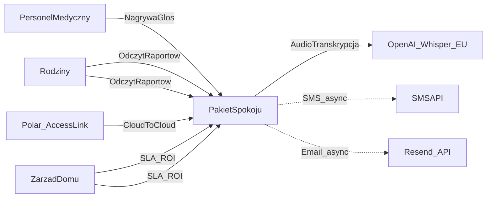

# Dokument Architektury Systemowej (HLD) — Pakiet Spokoju (SmartSenior)

| Pole | Wartość |
|------|---------|
| **Wersja** | 2.4.1 |
| **Data** | 2026-08-13 |
| **Autor** | Dariusz Olszewski-Rink (Dragonfly Ops) |
| **Przeznaczenie** | Zespół (SDD), interesariusze, due diligence (VC/grants) |
| **Strażnik** | Reguła Cursor `architectural-guardian` + skill `.agents/skills/architectural-guardian` |

> **Podział źródeł prawdy (żeby nie duplikować):**  
> - **Ten plik (`docs/HLD.md`)** — decyzje architektoniczne, NFR, przepływy, compliance posture, ekonomika, roadmapa.  
> - **[`MASTER_CONTEXT.md`](MASTER_CONTEXT.md)** — żywy stan implementacji (schema, RLS, deploy, changelog).  
> - **[`SECURITY.md`](../SECURITY.md)** — non-negotiables inżynierskie Secure by Design.  
> Detale tabel i polityk RLS **nie** są powielane tutaj — patrz MASTER_CONTEXT §5–6.

---

## A. Wstęp i założenia

### A.1 Cel i zakres

Dokument określa wysokopoziomową architekturę (HLD) platformy B2B SaaS „Pakiet Spokoju”. Jest bazą Spec Driven Development oraz fundamentem due diligence. **Nie** pokrywa LLD (detali kodu).

### A.2 Uzasadnienie stosu

| Warstwa | Wybór | Dlaczego |
|---------|--------|----------|
| Backend / DB | Supabase (PostgreSQL + Auth + RLS + Edge Functions) | Multi-tenant przez RLS; brak własnego DevOps serwerowego; region UE |
| Frontend | Next.js App Router + Tailwind + TS (`/web`, ADR-008) na **Cloudflare** (`@opennextjs/cloudflare`) | Edge UE; **zakaz Vercel**; Guardrails zostają na Supabase Edge |
| AI | OpenAI Whisper + GPT-4o (opcjonalnie Azure OpenAI EU) | Transkrypcja PL + Guardrails; Zero-Data Retention / Enterprise DPA gdy wymagane |
| Wearables | Polar AccessLink (cloud-to-cloud, ADR-007) | Brak własnych bramek BLE; non-MD (komfort / samopoczucie) |
| Komunikacja | SMSAPI + Resend (PL/EU) | Proaktywne Peace Letter bez aplikacji mobilnej rodziny |

**Stan operacyjny projektu (źródło: MASTER_CONTEXT):** Supabase `project-ref` `bmughdoqdsjfstxnnjks`, region **North EU (Stockholm)**; front kanoniczny = Next.js na Cloudflare OpenNext (Worker `smart-senior-web`); legacy Pages `smart-senior` do cutoveru.

> **Challenge vs wcześniejsze drafty HLD:** część materiałów mówiła „Frankfurt”. **Obowiązuje region faktycznie podlinkowany** (Stockholm). **Hosting frontu: nie Vercel.** Adapter Next.js = `@opennextjs/cloudflare` (nie `@cloudflare/next-on-pages`). Dane medyczne zostają w Supabase Stockholm — Cloudflare serwuje UI.

### A.3 Wymagania niefunkcjonalne (NFR)

| Kategoria | Wymaganie | Cel | Metryka |
|-----------|-----------|-----|---------|
| Dostępność | 99.5% uptime | System krytyczny dla komunikacji | Miesięczny uptime ≥ 99.5% |
| Wydajność | Zapis notatki &lt; 60 s; latency AI &lt; 15 s | Odciążenie personelu | p95 czasu przetwarzania |
| Odporność | Kolejka notatek przy braku sieci (przebudowa przy Next.js) | Martwe strefy Wi-Fi | 100% notatek zsynchronizowanych po odzyskaniu sieci |
| Prywatność | RODO + minimalizacja | ISO 27001 / audyt | Zero incydentów RODO w audycie zewnętrznym |
| Bezpieczeństwo | Zero-Trust + RLS | Brak wycieku między tenantami | 100% zapytań pod `organization_id` (poza `superadmin`) |

---

## B. Diagramy architektury (C4)

### B.1 Context — zależności zewnętrzne



### B.2 Data flow — Conversational Voice + Guardrails (human-in-the-loop)

Asystent **nie** kończy pracy po jednej głosówce. Krótka lub niekompletna transkrypcja → pytanie do personelu. Peace Letter powstaje z **wieczornego merge** draftów i zatwierdzenia (`approved_by_user_id`). ADR-010.

```mermaid
sequenceDiagram
  participant App as App_Personel
  participant Edge as Edge_AI
  participant LLM as OpenAI_EU
  participant DB as Postgres_RLS
  participant Cron as Merge_CRON

  App->>Edge: UploadAudio_TLS_JWT
  Edge->>LLM: Whisper_transcribe
  LLM-->>Edge: raw_text
  Edge->>LLM: Guardrails_conversation_JSON
  LLM-->>Edge: mode_follow_up_or_draft
  alt mode_follow_up
    Edge->>DB: voice_turns_plus_draft_awaiting_staff
    Edge-->>App: Pytanie_uzupelniajace
  else clinical_or_ok
    Edge->>DB: voice_draft_notes_staff_internal_split
    Note over Edge,DB: Żargon kliniczny nigdy do rodziny; godność = generalizacja
    Edge-->>App: Zanotowano_szkic
  end
  Cron->>DB: Drafts_ready_to_merge_per_patient_day
  Cron->>LLM: Merge_plus_Guardrails
  LLM-->>Cron: Peace_Letter_candidate
  Cron->>DB: daily_logs_is_ai_generated
  Note over Cron,App: Wysyłka rodziny dopiero po approved_by_user_id
```

**Interactive prompting:** brak nastroju / posiłku (pora obiadowa) / snu / aktywności albo transkrypt zbyt krótki → `mode=follow_up`, **zakaz** końcowego raportu.

**Cenzura (priorytet):**
- Brak diagnoz w kanale rodziny — żargon (arytmia, furosemid, …) tylko `staff_internal_notes` / `raw_data`.
- Godność (Ustawa o pomocy społecznej): detale drastyczne → „dyskomfort” / „gorsze samopoczucie”.
- System Prompt kanoniczny: `.cursor/rules/ai-prompt-guardrails.mdc`.

**Merge:** wiele `voice_draft_notes` tego samego `(patient_id, local_date)` → Edge CRON `merge-daily-peace-letters` (Europe/Warsaw, wieczór).

**Zasada krytyczna:** żadne parsowanie / filtrowanie / Guardrails treści medycznej w przeglądarce. Frontend = UI + kolejka offline + wywołania z JWT. Transkryptów **nie haszować** (ADR-005).

### B.3 Data flow — telemetria Polar AccessLink (wzbogacenie, nie zastąpienie głosu)

```mermaid
sequenceDiagram
  participant Band as Polar360
  participant Polar as Polar_AccessLink
  participant Edge as Edge_Polar_webhook
  participant DB as Postgres_RLS
  participant AI as Edge_AI_Guardrails

  Band->>Polar: Sync_hub_placowka
  Polar->>Edge: Webhook_OAuth_payload
  Note over Edge,DB: Faza 4 — szkielet Edge; Faza 1 DROP iot_gateways
  Edge->>DB: UPSERT_telemetry_or_polar_tables
  Note over AI,DB: AI czyta agregaty + voice transcript
  AI-->>AI: Peace_Letter_activity_mood_only_non_MD
```

---

## C. Architektura danych

**Tabele (szczegóły w MASTER_CONTEXT):** `organizations`, `profiles`, `patients`, `daily_logs`, `voice_conversations`, `voice_conversation_turns`, `voice_draft_notes`, `telemetry_logs`, `family_connections`, `consent_ledger`, `polar_*`, `audit_logs` + widoki `family_daily_reports`, `family_wearable_comfort`. Tabela `iot_gateways` **usunięta** (ADR-007).

**Głos (HLD 2.4.1 / ADR-010):** drafty i tury rozmowy — tylko personel (`org_admin` / `nurse`). Family: brak SELECT. Peace Letter nadal w `daily_logs` po merge + HITL. `voice_conversations.missing_contexts` to `voice_missing_context[]` (`mood`, `meal`, `sleep`, `activity`).

**Telemetria (HLD 2.3.2 / ADR-007 / ADR-009):** Polar AccessLink. Agregaty w `polar_daily_activity` / `polar_sleep_nights` / `polar_heart_rate_daily` / `polar_hrv_nights`. Client SELECT metryk: rodzina z przypisaniem **i** zgodą `wearable_family_access`; personel (`org_admin` / `nurse`) tej samej org (Big Picture). Preferowany DTO rodziny: `family_wearable_comfort` (bez BPM/HRV). `telemetry_logs` = legacy, family bez SELECT. Non-MD: komfort, zero diagnozy.

**OAuth / webhook (Faza 4):** Edge `polar-oauth` + `polar-webhook`. Tokeny w `polar_oauth_secrets`. Sygnatura AccessLink: nagłówek `Polar-Webhook-Signature` (HMAC-SHA256).

**EU AI Act (schema):** `daily_logs.is_ai_generated` + `approved_by_user_id` — transparentność i human oversight przed Peace Letter.

**`consent_ledger`:** wdrożony (Faza 3) — na start purpose `wearable_family_access`; wpisuje `org_admin`.

### Retencja i backup

| Warstwa | Polityka |
|---------|----------|
| Surowe głosówki (`voice_draft_notes` merged/discarded, tury i rozmowy `merged`/`abandoned`) | 30 dni od `created_at`, potem `cleanup_old_voice_drafts()` (tylko `service_role`) |
| Hot | Peace Letter / `daily_logs` ~12 miesięcy |
| Cold | Po 12 mies. pseudonimizacja / archiwum wg SLA placówki |
| Archiwum pensjonariusza | `patients.archived_at` + `archived_reason` (`deceased`, `left_facility`, `gdpr_request`) — miękka blokada; twarde Art. 17 = `DELETE patients` (CASCADE na metryki i głos) |
| Backup | PITR UE; **RTO = 4 h**, **RPO = 1 h** |

`audit_logs` przy DELETE na tabelach opieki/głosu/Polar zapisuje `old_data.payload = [REDACTED DUE TO GDPR]` (Art. 17). UPDATE nadal trzyma pełny snapshot (ISO). Job `cleanup-old-voice-drafts`: 03:00 Europe/Warsaw (`pg_cron`).

---

## D. Bezpieczeństwo i compliance (Secure by Design)

Szczegóły inżynierskie: [`SECURITY.md`](../SECURITY.md). Normy: skill `compliance-medtech`.

### D.1 Pseudonimizacja i kryptografia treści

- W `daily_logs` powiązanie przez `patient_id`; UI personelu: imię + inicjał („Jan K.”), nie pełne PII w feedzie rodzinnym.
- PESEL (gdy wymagany): hash SHA-256 + salt (`pesel_hash`) — nigdy plaintext.
- **Zakaz hashowania** narracji opieki (`raw_data` / `processed_data`) — ADR-005; ochrona = RLS + minimalizacja + at-rest/in-transit Supabase; CLE poza zakresem obecnej fazy.

### D.2 Threat model (skrót)

| Zagrożenie | Reakcja |
|------------|---------|
| Kradzież tabletu | Krótki TTL JWT; revoke sesji w Supabase Auth |
| Wyciek / anomalia | Blokada Edge (runbook); alert adminów; UODO / klient ≤ 24 h |
| Cross-tenant | RLS + JWT `app_metadata.organization_id` (ADR-006); testy E2E izolacji |

### D.3 EU AI Act (postawa)

- **Zamierzone użycie:** AI wspiera dokumentację i Peace Letter — **nie** diagnoza / triage / autonomiczne decyzje opiekuńcze.
- **Human-in-the-loop:** personel uzupełnia kontekst w rozmowie, potem zatwierdza scalony Peace Letter (HLD §B.2).
- **Transparentność:** UI nie ukrywa, że treść jest wspierana przez AI (Art. 50).
- **Godność i klinika:** kanał rodziny bez żargonu medycznego i bez detali naruszających godność (Ustawa o pomocy społecznej; ADR-010).
- **Reklasyfikacja:** nowe funkcje (np. auto-alert kliniczny) → review `compliance-medtech` / `eu-ai-act.md` + aktualizacja HLD przed ship.

---

## E. Degraded mode (NIS2 / cyber resilience)

| Awaria | Zachowanie |
|--------|------------|
| Brak sieci w ośrodku | Kolejka audio / notatek po stronie klienta (przebudowa przy Next.js, ADR-008); legacy PWA nie jest kierunkiem |
| OpenAI down | Kolejka `voice_draft_notes`; brak utraty notatek; retry; **nie** pomijaj Guardrails |
| SMSAPI / Resend down | Exponential backoff 5/15/30/60 min; po 4 próbach `Failed_Delivery` w panelu org |

---

## F. Testowalność i QA

### Środowiska

| Env | Opis |
|-----|------|
| DEV | Supabase CLI / lokalnie (opcjonalnie Docker) |
| STAGING | Lustro chmurowe, dane zanonimizowane |
| PRODUCTION | EU, osobne sekrety, Cloudflare OpenNext (`/web`); legacy Pages `smart-senior` do cutoveru |

### Strategia testów

- Unit / E2E: izolacja tenantów (pielęgniarka A ≠ pacjent org B).
- Guardrails AI: zestaw ≥100 przypadków (prompt injection, wyciek kliniczny, follow-up, godność). CI nie przepuszcza nowego System Promptu, jeśli model wypuści treść kliniczną jako Peace Letter.

---

## G. Ekonomika i licencjonowanie

### COGS (przykład: 100 łóżek / mies.)

| Składnik | Best / Realistic / Worst (USD) |
|----------|--------------------------------|
| Supabase + Cloudflare | 25–50 / 40 / 70 |
| LLM (Whisper + GPT-4o) | 30–50 / 45 / 80 |
| SMS + e-mail | 20–40 / 35 / 60 |
| **Razem COGS** | **75–140 / 120 / 210** |

### Pricing (kierunek)

- SaaS flat fee: **1500–3500 PLN netto / mies.** na ośrodek (pakiet powiadomień).
- Cel marży brutto ~85–90% przy skali.

> Model per-pensjonariusz + AI overage może uzupełniać flat fee przy komercjalizacji — decyzja produktowa, aktualizuj tę sekcję gdy zamrażasz cennik oferty.

---

## H. Roadmapa

| Faza | Termin | Deliverables |
|------|--------|----------------|
| **1 MVP** | Q3 2026 | Multi-tenant, Next.js (`/web`), conversational Voice AI + Guardrails (godność/klinika), wieczorny merge Peace Letter, Polar, SMS/e-mail, audyt RODO/ISO; pilotaż Marconi |
| **2 Skalowanie** | Q4 2026 | Portale rodzina + admin; produkcyjny Whisper/GPT Edge; kolejne placówki |
| **3 Ekosystem** | Q1–Q2 2027 | Pełny ekosystem IoT (ring / więcej sensorów), agent Antoś, opcjonalnie EHR/HL7/FHIR |

### H.1 Challenge: Polar AccessLink zamiast bramek BLE (2.3.0)

**Decyzja (ADR-007 / ADR-009):** cloud-to-cloud Polar AccessLink. Agregaty w tabelach `polar_*`. `telemetry_logs` = legacy. Zgoda rodziny: `consent_ledger.wearable_family_access`.

**Cel produktowy:** wzbogacenie raportów głosowych — **nie** ich zastąpienie.

**Non-MD / Guardrails / MDR:** system **nie** jest wyrobem medycznym. Sen, HRV, tętno służą wyłącznie opisowi komfortu i samopoczucia. Zakaz diagnozy, triage, alarmów klinicznych z opaski. Peace Letter i UI rodziny: nastrój i aktywność — bez „puls 112”. Personel widzi agregaty Polar na podglądzie placówki (nie jako pulpit diagnostyczny).

**Poza zakresem Fazy 2:** surowy stream próbek, diagnoza, Antoś, EHR.

### H.2 Challenge: Conversational Voice zamiast jednorazowego dyktowania (2.4.0)

**Decyzja (ADR-010):** aktywny asystent — follow-up, separacja kliniki, cenzura godności, wieczorny merge wielu głosówek. Schema `voice_*` jest w MVP; produkcyjny Whisper/GPT Edge = implementacja po Fazie 5 architektury.

---

## I. Status dostawców i DPA (art. 28)

| Dostawca | Rola | DPA / uwagi |
|----------|------|-------------|
| Supabase | DB/Auth/Edge UE | DPA / SCC — akceptacja przed prod medyczną |
| OpenAI / Azure OpenAI | AI EU, Zero-Data Retention gdy Enterprise | DPA w umowie Enterprise |
| Cloudflare | Front Next.js (OpenNext / Workers Assets) + CDN; bez przechowywania treści medycznej | DPA; **zakaz Vercel** (ADR-008) |
| SMSAPI / Resend | Powiadomienia PL/EU | DPA przy koncie biznesowym |

---

## J. Słownik

| Termin | Znaczenie |
|--------|-----------|
| `raw_data` | Surowa transkrypcja — tylko personel / backend |
| `processed_data` | Tekst po Guardrails — Peace Letter dla rodziny |
| Peace Letter | Empatyczne podsumowanie dnia (bez żargonu klinicznego) — po wieczornym merge + HITL |
| `voice_conversations` | Stan rozmowy; `missing_contexts voice_missing_context[]` |
| `voice_draft_notes` | Surowe, niezatwierdzone głosówki przed merge (tylko personel); retencja 30 dni po merge/discard |
| `pending_clinical_review` | Blokada auto-wysyłki do rodziny do akceptacji |
| Guardrails | Twarde reguły System Prompt + walidacja po stronie Edge (rozmowa, klinika, godność) |
| RLS | Izolacja wierszy w PostgreSQL |
| Edge Functions | Deno/TS na brzegu Supabase |
| Zero-Trust | Brak domyślnego zaufania; weryfikacja JWT / tokenu urządzenia |
| `telemetry_logs` | Legacy agregaty BLE; family bez SELECT |
| Polar `polar_*` | Dzienna aktywność, sen, tętno, HRV (ADR-009); ingest = Faza 4 |
| Polar AccessLink | Cloud-to-cloud Polar 360 (ADR-007) |
| `consent_ledger` | Zgody; `wearable_family_access` dla kanału rodziny |

---

## K. Ryzyka i mitygacje

| # | Ryzyko | P | W | Mitygacja |
|---|--------|---|---|-----------|
| 1 | Wzrost kosztów OpenAI | Śr | Wys | Batching, GPT-4o-mini fallback, monitoring tokenów |
| 2 | Halucynacje / Guardrails | Nisk | Krytyczny | 100+ testów regresji + human-in-the-loop |
| 3 | Opór personelu | Śr | Śr | Voice-first UX, szkolenia, mało klików |
| 4 | Zmiana RODO / NIS2 / AI Act | Nisk | Wys | Privacy-by-design, human-in-the-loop, gotowość audytowa |
| 5 | Awaria Supabase | Nisk | Wys | PITR; multi-cloud readiness w Fazie 3 |
| 6 | Dostarczalność SMS | Śr | Śr | Fallback e-mail + multi-provider |

---

## L. Changelog HLD

| Wersja | Data | Zmiana |
|--------|------|--------|
| 2.4.1 | 2026-08-13 | Enum `voice_missing_context[]`; archiwum `patients`; cleanup surowych głosówek 30 dni (`service_role`) |
| 2.4.0 | 2026-08-13 | Faza 5: Conversational Voice AI (ADR-010) — follow-up, cenzura kliniki/godności, `voice_draft_notes` + wieczorny merge Peace Letter |
| 2.3.3 | 2026-08-13 | Faza 3 RLS opcja A: staff SELECT Polar; Faza 4 szkielet AccessLink `polar-oauth` + `polar-webhook` (HMAC `Polar-Webhook-Signature`) |
| 2.3.2 | 2026-08-13 | Faza 3: tabele Polar + `consent_ledger`; RLS family+zgoda (ADR-009); personel bez SELECT metryk Polar w kliencie |
| 2.3.1 | 2026-08-13 | Front Next.js wyłącznie na Cloudflare (OpenNext / Workers Assets); zakaz Vercel; `@cloudflare/next-on-pages` nie jest adapterem |
| 2.3.0 | 2026-08-13 | Silver Care MVP v2 Faza 1: Polar AccessLink (ADR-007) zamiast bramek BLE; Next.js w `/web` (ADR-008); DROP `iot_gateways`; legacy Vanilla do Fazy 2 |
| 2.2.3 | 2026-08-13 | ADR-006: RLS z Custom JWT Claims (Auth Hook); odejście od SECURITY DEFINER lookup na `profiles`; onboarding B2B Edge |
| 2.2.2 | 2026-08-13 | ADR-005: PESEL/ID → SHA-256+salt; zakaz hashowania treści medycznej; brak CLE; platform crypto Supabase |
| 2.2.1 | 2026-08-12 | ADR-002: `iot_gateways` (per-org Bearer) zamiast globalnego ENV; kolumny AI Act na `daily_logs`; TDD Guardrails Green (zaślepka CI) |
| 2.2.0 | 2026-08-11 | Telemetria BLE (agregaty) w Fazie 2: `telemetry_logs` + Edge ingest; non-MD Guardrails; family bez SELECT na HR; pełne IoT/Antoś/EHR pozostaje Faza 3 |
| 2.1.0 | 2026-07-19 | Ujednolicenie z repo: region Stockholm, podział HLD vs MASTER_CONTEXT vs SECURITY; `consent_ledger` jako planowane; Strażnik Architektury |
| 2.0.x | Lipiec 2026 | Draft HLD (stakeholder / VC) |
